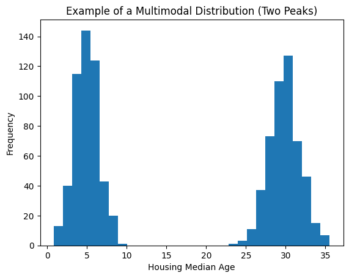

# Advanced Feature Engineering techniques for more robust models.

## What is Bucketizing?

"Dividing a numeric variable into intervals (buckets) and replacing the value with the bucket it belongs to."

> It's not standardization, it's grouping into categories.

The model no longer sees the exact number, but rather the range it belongs to.

## Population Bucketization Example

In this example, we transform a continuous **population** variable into discrete buckets for use in a machine learning model.

### Original Values → Bucketed Results

| Original Population | Processed Value | Bucket |
|--------------------|---------------|--------|
| 500                | 500           | 0      |
| 800                | 800           | 0      |
| 1200               | 1200          | 1      |
| ...                | ...           | ...    |

### Bucket Definition

- **Bucket 0**: Population < 1000  
- **Bucket 1**: Population ≥ 1000  

## Notes

- Bucketization (or binning) helps reduce noise and model complexity.
- It is commonly used in feature engineering for tree-based models and linear models.
- The thresholds (e.g., 1000) can be chosen based on domain knowledge or data distribution.

---

## After Bucketizing: No Giant Numbers

After applying bucketization, large and highly dispersed values are transformed into a small set of discrete categories.

### Before → After (5 Buckets)

| Before (Population) | After (Bucket) |
|--------------------|----------------|
| 200                | 0              |
| 500                | 1              |
| 10000              | 2              |
| 30000              | 3              |
| ...                | ...            |

### Key Insight

- Original values were **highly dispersed** (ranging from hundreds to tens of thousands).
- After bucketizing, values are mapped into a **small, fixed range** (e.g., 0–4).
- This removes the issue of **giant numbers dominating the scale**.

> The values are already on a small scale; additional scaling is not necessary.

### Why This Matters

- Improves model stability for some algorithms
- Reduces sensitivity to extreme values (outliers)
- Simplifies feature representation

---

## When to Use Bucketing?

### 1. The exact value doesn't matter
Age: 22 vs 23 → irrelevant

`18 - 25`, `26 - 35`, `36 - 50`
> The group matters, not the exact number

### 2. Very large extreme values
Income: 1000 ... 200000

`0 - 2000`, `2000 - 5000`, `5000+`

> The outlier no longer distorts the model

### 3. Non-linear relationship
Age vs Risk

`0 - 18: low`, `18 - 25: medium`, `25 - 60: medium`, `60+: high`
> The ranges capture the true pattern

---

## Multimodal Distributions

A distribution with two or more peaks (modes) in its histogram

Example: Housing Median Age

> many new houses → peak 1
> 
> many old houses → peak 2
> 
> few in the middle

> *A linear model assumes price = $a * age + b$ a single straight line*

### Example Multimodal Distribution Code:
```python
# Create a bimodal distribution (two peaks)
np.random.seed(0)
young_houses = np.random.normal(loc=5, scale=1.5, size=500)
old_houses = np.random.normal(loc=30, scale=2, size=500)

data = np.concatenate([young_houses, old_houses])

# Plot histogram
plt.figure()
plt.hist(data, bins=30)
plt.xlabel("Housing Median Age")
plt.ylabel("Frequency")
plt.title("Example of a Multimodal Distribution (Two Peaks)")
plt.show()
```

