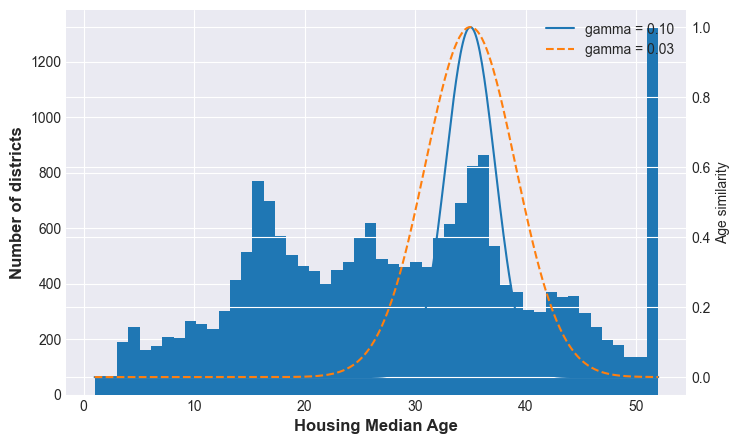

# Advanced Feature Engineering techniques for more robust models.

## What is Bucketizing?

"Dividing a numeric variable into intervals (buckets) and replacing the value with the bucket it belongs to."

> It's not standardization, it's grouping into categories.

The model no longer sees the exact number, but rather the range it belongs to.

## Population Bucketization Example

In this example, we transform a continuous **population** variable into discrete buckets for use in a machine learning model.

### Original Values → Bucketed Results

| Original Population | Processed Value | Bucket |
|--------------------|---------------|--------|
| 500                | 500           | 0      |
| 800                | 800           | 0      |
| 1200               | 1200          | 1      |
| ...                | ...           | ...    |

### Bucket Definition

- **Bucket 0**: Population < 1000  
- **Bucket 1**: Population ≥ 1000  

## Notes

- Bucketization (or binning) helps reduce noise and model complexity.
- It is commonly used in feature engineering for tree-based models and linear models.
- The thresholds (e.g., 1000) can be chosen based on domain knowledge or data distribution.

---

## After Bucketizing: No Giant Numbers

After applying bucketization, large and highly dispersed values are transformed into a small set of discrete categories.

### Before → After (5 Buckets)

| Before (Population) | After (Bucket) |
|--------------------|----------------|
| 200                | 0              |
| 500                | 1              |
| 10000              | 2              |
| 30000              | 3              |
| ...                | ...            |

### Key Insight

- Original values were **highly dispersed** (ranging from hundreds to tens of thousands).
- After bucketizing, values are mapped into a **small, fixed range** (e.g., 0–4).
- This removes the issue of **giant numbers dominating the scale**.

> The values are already on a small scale; additional scaling is not necessary.

### Why This Matters

- Improves model stability for some algorithms
- Reduces sensitivity to extreme values (outliers)
- Simplifies feature representation

---

## When to Use Bucketing?

### 1. The exact value doesn't matter
Age: 22 vs 23 → irrelevant

`18 - 25`, `26 - 35`, `36 - 50`
> The group matters, not the exact number

### 2. Very large extreme values
Income: 1000 ... 200000

`0 - 2000`, `2000 - 5000`, `5000+`

> The outlier no longer distorts the model

### 3. Non-linear relationship
Age vs Risk

`0 - 18: low`, `18 - 25: medium`, `25 - 60: medium`, `60+: high`
> The ranges capture the true pattern

---

## Multimodal Distributions

A distribution with two or more peaks (modes) in its histogram

Example: Housing Median Age

> many new houses → peak 1
> 
> many old houses → peak 2
> 
> few in the middle

> *A linear model assumes price = $a * age + b$ a single straight line*

### Example Multimodal Distribution Code:
```python
# Create a bimodal distribution (two peaks)
np.random.seed(0)
young_houses = np.random.normal(loc=5, scale=1.5, size=500)
old_houses = np.random.normal(loc=30, scale=2, size=500)

data = np.concatenate([young_houses, old_houses])

# Plot histogram
plt.figure()
plt.hist(data, bins=30)
plt.xlabel("Housing Median Age")
plt.ylabel("Frequency")
plt.title("Example of a Multimodal Distribution (Two Peaks)")
plt.show()
```


---

## The Solution: Buckets + One-Hot Encoding

To handle multimodal distributions, we can transform a continuous variable (like age) into **buckets**, and then encode them properly.

### Step 1: Bucketization

| Age Range | Bucket |
|----------|--------|
| 0 – 10   | A      |
| 10 – 30  | B      |
| 30 – 50  | C      |
| 50+      | D      |

### ⚠️ Bad Idea: Using Numeric Labels

If we encode buckets as:

| Bucket | Value |
|--------|------|
| A      | 0    |
| B      | 1    |
| C      | 2    |
| D      | 3    |

The model may incorrectly assume:

> 3 > 2 > 1 → an **ordered relationship** that does NOT exist.

This introduces **false meaning** into the data.

---

### Step 2: One-Hot Encoding

Instead, we convert each bucket into a binary feature:

| Bucket | A | B | C | D |
|--------|---|---|---|---|
| A      | 1 | 0 | 0 | 0 |
| B      | 0 | 1 | 0 | 0 |
| C      | 0 | 0 | 1 | 0 |
| D      | 0 | 0 | 0 | 1 |

---

### ✅ Why This Works

- No implicit ordering between categories
- Each bucket is treated independently
- Works well with linear models

> Each bucket becomes a binary column, with no hidden assumptions about magnitude or order.

---

## What the model gains

| Aspect | Without Bucketizing | With Bucketizing + One-Hot Encoding (OHE) |
|--------|--------------------|-------------------------------------------|
| Model Form | `price = a * age + b` | `price = b + wA·bucket_A + wB·bucket_B + wC·bucket_C + wD·bucket_D` |
| Relationship Type | Single linear relationship between age and price | Piecewise constant relationship (different weights per range) |
| Flexibility | Low — assumes price changes uniformly with age | High — allows different behaviors in different age ranges |
| Interpretation | One slope (`a`) applies to all ages | Each bucket has its own weight (wA, wB, wC, wD) |
| Handling Non-Linearity | Poor — cannot capture complex patterns | Good — approximates non-linear patterns via discrete segments |
| Example Behavior | Price always increases or decreases with age | Price varies by bucket:<br>• A (0–10): High<br>• B (10–30): Medium<br>• C (30–50): Low<br>• D (50+): High |
| Model Insight | Oversimplifies real-world patterns | Captures segment-specific trends |
| Key Limitation | Too rigid | Loses smooth transitions between ranges |
| What the Model Gains | Simplicity | Ability to model non-linear effects while remaining linear in parameters |

> Linearity is captured

---

## Radial Basis Function

### What is an RBF?

**Measures how close a value is to a specific point**

A feature engineering technique for capturing nonlinear patterns.

Useful in multimodal distributions.

Key properties:
- Small distance → Large value
- Large distance → Small value
> Measures similarity based on distance

**New feature: similarity_with_35:**

| **Age** | **similarity_with_35** |
|---------|:----------------------:|
| 35      | 1.00                   |
| 34      | 0.95                   |
| 30      | 0.50                   |
| 20      | 0.05                   |
| 10      | ≈ 0                    |

---

### The Non-Linear Pattern: Age vs. Price

`housing_median_age`

Homes that are approximately 35 years old tend to be cheaper.
- Older design
- Not modern
- Not historic

> - Newer homes → expensive
> - 35 years old → cheap
> - Very old homes → expensive
>
> This clearly does not follow a linear relationship.

---

### What does the RBF feature achieve?

It creates a variable that measures proximity to the critical point.

**35 years old**

`similarity_to_35`

The RBF function is activated near the central point.

> x = central_point → maximum value
> 
> x far from the point → small value

**WHAT THE MODEL LEARNS**
> if similarity_to_35 is high → lower price

- Detects important areas within the variable
- Captures patterns that the original variable cannot
- Complements (does not replace) the original variable

### Code

```python
# Calculate the similarity of each age to a reference age using the RBF kernel.
ages = housing_pl["housing_median_age"].to_numpy()

# Create a range of ages for plotting the similarity function
age_range = np.linspace(ages.min(), ages.max(), 500).reshape(-1, 1)

# Calculate the RBF kernel similarity to a reference age with different gamma values
sim_gama_01 = rbf_kernel(age_range, [[35]], gamma=0.1)
sim_gama_003 = rbf_kernel(age_range, [[35]], gamma=0.03)

# Plot the histogram of ages and the similarity functions
fig, ax1 = plt.subplots(figsize=(8, 5))

# Histogram of housing median ages
ax1.hist(ages, bins=50)
ax1.set_xlabel("Housing Median Age", fontsize=12, fontweight = "bold")
ax1.set_ylabel("Number of districts", fontsize=12, fontweight= "bold")

# Create a secondary Y-axis to plot the similarity functions
ax2 = ax1.twinx()
ax2.plot(age_range, sim_gama_01, label="gamma = 0.10")
ax2.plot(age_range, sim_gama_003, linestyle = "--", label = "gamma = 0.03")
ax2.set_ylabel("Age similarity")
ax2.legend()
plt.show()
```

