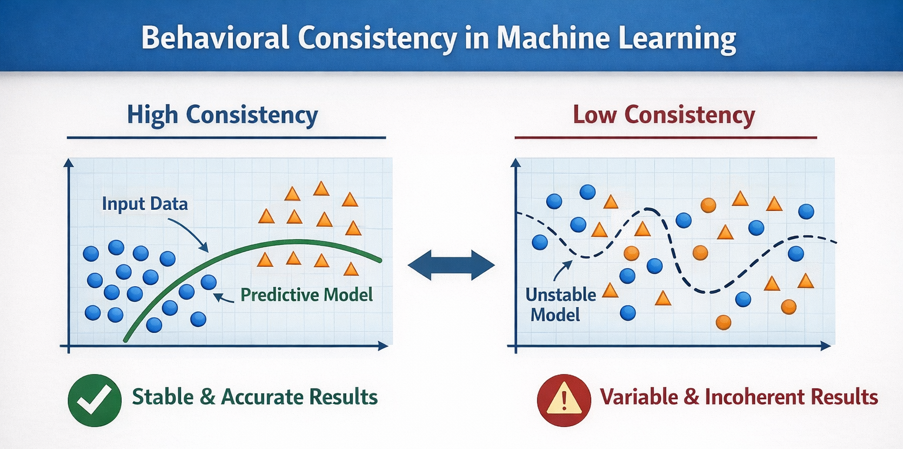
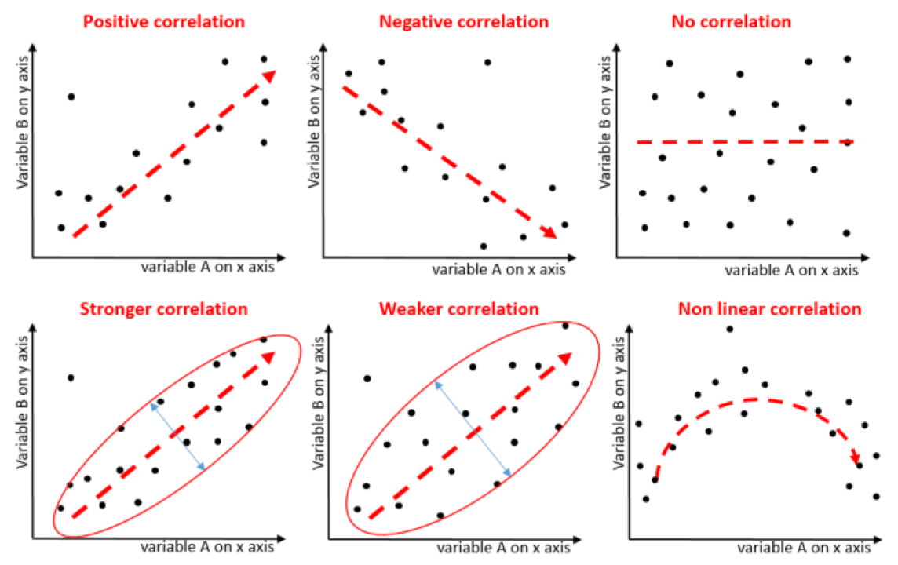
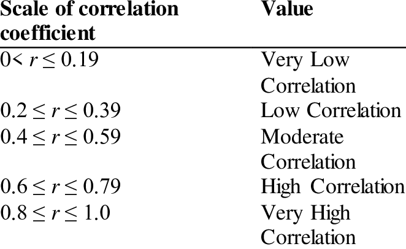

# Standard Correlation Coefficient - Covariance - Pearson - Feature Engineer

## What is the Standard Correlation Coefficient?

### Definition
- Measures the strength and direction of the linear relationship between two numerical variables
- Value between -1 and 1
- Standardized: independent of the scale
- Also called Pearson's coefficient

$$r = \frac{\sum (x_i - \bar{x})(y_i - \bar{y})}{\sqrt{\sum (x_i - \bar{x})^2 \sum (y_i - \bar{y})^2}}$$

---



## What are the exact measurements?



---

## Covariance Depends on the Scale

> The relationship is the same, but the covariance changes if you change the scale

### Original Data
```
X: [1, 2, 3, 4]
Y: [1, 2, 3, 4]
Cov = 1.67
```
**Original Scale**
_The covariance can be:_
- 0.3
- 50
- 10,000
- 2,000,000
> There is no universal limit

### X multiplied by 10
```
X: [10, 20, 30, 40]
Y: [1, 2, 3, 4]
Cov = 16.7
```
**10x greater - same relationship**
> 1.67 does not mean "strong" or "weak"
> 
> It only indicates a positive relationship on that scale

---

## The "Non-Magic" of Pearson's Coefficient

### It's called **"standard"** because it's standardized
> The scale always cancels out: `r always between -1 and 1`

**Always -1 <= r <= 1 regardless of the scale, comparable and standardized**



## Code:
```python
corr_matrix = housing_pd.corr(numeric_only=True)
corr_matrix["MedHouseVal"].sort_values(ascending=False)

MedHouseVal    1.000000
MedInc         0.688075
AveRooms       0.151948
HouseAge       0.105623
AveOccup      -0.023737
Population    -0.024650
Longitude     -0.045967
AveBedrms     -0.046701
Latitude      -0.144160
Name: MedHouseVal, dtype: float64
```

> This makes perfect sense for several reasons; keep in mind that people with higher incomes tend to live in homes with better amenities.

---

## Feature Engineering

### Create, Transform, or Select Variables
> so the model learns better

Converts raw data into more useful information.

- Doesn't change the algorithm
- Improves what the algorithm sees

### Raw Data
total_rooms, households, population

### Feature Engineering
Create new derived variables

### Improved Features
rooms_per_houses, bedrooms_per_houses, people_per_houses

```python
housing_pd["rooms_per_house"] = housing_pd["total_rooms"] / housing_pd["HouseAge"]

housing_pd["bedrooms_per_room"] = housing_pd["total_bedrooms"] / housing_pd["total_rooms"]

housing_pd["people_per_houses"] = housing_pd["Population"] / housing_pd["HouseAge"]

```