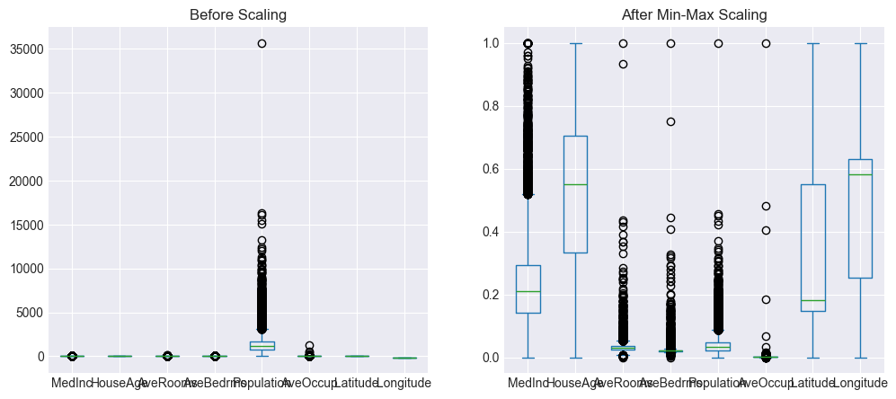
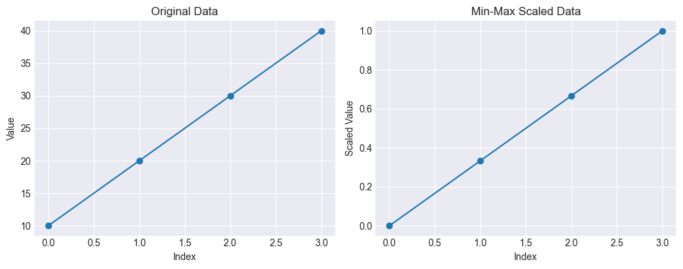
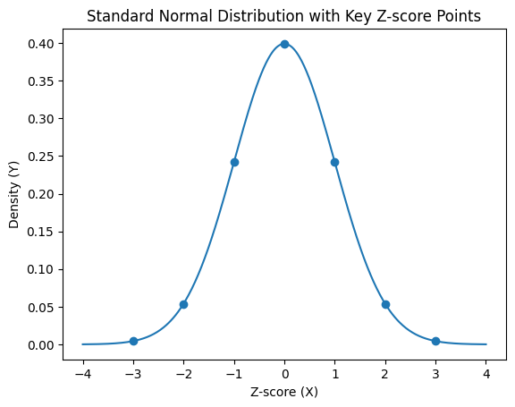
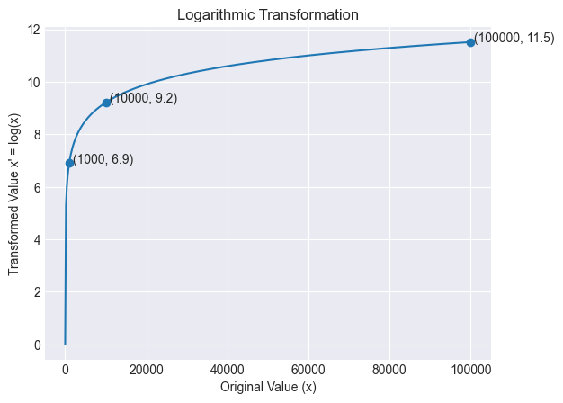
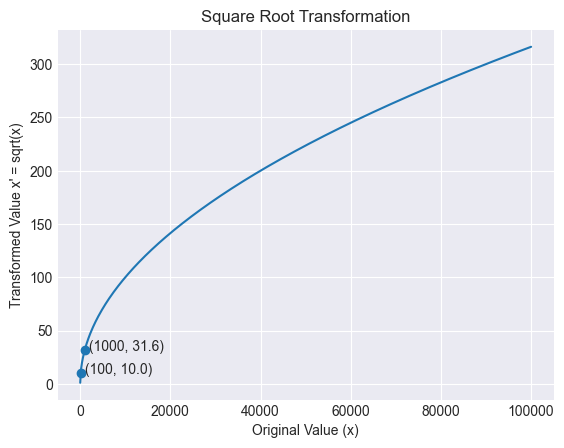

# How to prepare your variables so that models learn better

## What is Feature Scaling?

A mathematical transformation that adjusts the scale of numerical variables without altering their information.

### Why?
To prevent variables with large ranges from dominating others in model calculations.

> The problem arises when different features have very different orders of magnitude.

### **Scale-Sensitive Algorithms**
- KNN: Euclidean distances
- K-Means: Centroids
- Gradient Descent: Convergence
- Neural Networks: Activations
- PCA: Variance

---

## The Scaling Problem with the `California Housing Dataset`

### Highly Disparate Ranges
Total_rooms reaches 39,320 while median_income only reaches 15.

_Without scaling, the model gives more weight to large variables... even if they aren't necessarily more important._

> Median_income is the strongest predictor of price, but it has the smallest range!

```python
min           max         range
HouseAge      1.000000     52.000000     51.000000
AveRooms      1.130435    141.909091    140.778656
AveBedrms     0.333333     34.066667     33.733333⚠️
Population    3.000000  35682.000000  35679.000000⚠️
AveOccup      0.692308   1243.333333   1242.641026
Latitude     32.540000     41.950000      9.410000
Longitude  -124.350000   -114.310000     10.040000
MedInc        0.499900     15.000100     14.500200✅
```

---

## Normalized Min-Max Scaling

Rescales each variable to a fixed range [0, 1]

$$X' = \frac{(x- min)}{(max - min)}$$
> The result is always between 0 and 1

**Properties**
- ✅ Preserves the shape of the distribution
- ✅ Guaranteed range [0, 1] or [-1, 1]
- ⚠️ Sensitive to extreme outliers
- 🌟 Ideal for neural networks and KNNs




---

## Min-Max: Step-by-Step Example

1. Original Data: (10, 20, 30, 40)

2. Calculate min and max
- min = 10
- max = 40
- range = 30

3. Apply the formula
$$x' = \frac{(x- min)}{(max - min)}$$

$$x' = \frac{(x- 10)}{(30)}$$




> Minimum: 0
> 
> Maximum: 1
> 
> Same shape, new 

---

## Standardization `Z-Score Scaling`

$$z = \frac{(x - \mu)}{\sigma}$$

- $z$: original value
- $\mu:$ mean of the variable
- $\sigma:$ standard deviation
> The result indicates how much $\sigma$ the value is from the mean

- $\mu = 0$ Resulting mean
- $\sigma = 1$ Standard deviation

> Does not guarantee a fixed range, but works well with moderate outliers



---

### Standardization: Example with median_income

5 median_income values: $1.5, 3.0, 4.0, 5.0, 6.0$

- $\mu = 3.9$ `Mean`
- $\sigma = 1.56$ `Standard Deviation`

| median_income (x) | x − μ | z = (x − μ) / σ |
| ----------------- | ----- | --------------- |
| 1.5               | -2.4  | -1.54           |
| 3.0               | -0.9  | -0.58           |
| 4.0               | 0.1   | 0.06            |
| 5.0               | 1.1   | 0.71            |
| 6.0               | 2.1   | 1.35            |


> - mean of x' ≈ 0
> - standard deviation ≈ 1

---

## Comparison of Scaling Methods

| Method | Typical Range | When to Use | Key Note |
|------|------|------|------|
| Standardization (Z-score) | Mean = 0, Std = 1 | When data follows a roughly normal distribution and for models like Logistic Regression, SVM, and Linear Regression | Centers the data around the mean and scales by standard deviation |
| Min-Max Scaling | [0, 1] | When you need bounded features or when using neural networks and distance-based models like KNN | Sensitive to outliers because it uses min and max values |
| Robust Scaling | Typically around [-2, 2] but depends on IQR | When the dataset contains many outliers | Uses median and interquartile range (IQR) instead of mean and standard deviation |
| Max Absolute Scaling | [-1, 1] | When working with sparse datasets | Scales by dividing by the maximum absolute value |
| Log Scaling | No fixed range | When data is highly skewed (e.g., income, population) | Compresses large values and reduces skewness |

---

## The Problem: Heavy-Tailed Distributions

### Heavy-Tailed Distributions
A heavy-tailed distribution has extremely large values ​​that are not unusual.

Example: Population of districts
$800, 1200, 1500, 2000, ..., 30000

What does Min-Max Scaling do?

> Normal values ​​become: $0.000 → 0.005$
> The outlier becomes: $1.00$
> → Everything compressed close to $0$

> Standardization: The standard deviation is inflated → normal values ​​compressed close to $0$

---

## Solution: Transform Before Scaling

### Logarithm
$$x' = log(x)$$

$1,000 → 6.9 * 10,000 → 9.2 * 100,000 → 11.5$
- Very heavy tail
- Very large values
- Grows multiplicatively



### Square Root
$x' = \sqrt{x}$

$100 → 10 * 1,000 → 31.6$
- Slight asymmetry
- Large, non-extreme values
- Smoothing

