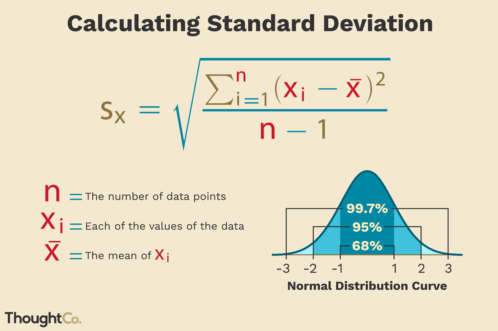
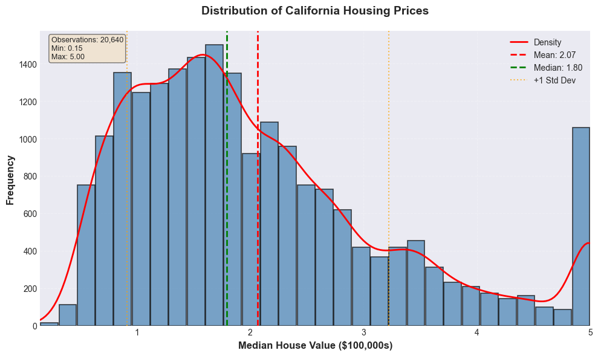

# Train/Test Split

## What are Percentiles

### % Percentiles
**Also known as quartiles.**

A percentile is the value below which a certain percentage of the data falls, once the data has been ordered from smallest to largest: 25%, 50%, 75%.

_Purpose: To describe how the data is distributed_

⚠️ Percentiles divide the ordered data into groups, revealing the actual distribution of the values.

---

### 25th Percentile (Q1)
First Quartile

In the California housing example, we are told that 25% of the median_house_value column has a value of $119,600.

What does this mean?

- 25% of the houses are worth less than $119,600
- 75% of the houses are worth more than this value

> **Houses in the Lower Range:**
> 25% ↓ | 75% ↑
> 
> This quartile represents the lowest-value homes on the market

---
### 50th Percentile (Q2 - Median)
The True Center Point

50% of the median_house_value column has a value of $179,700. This divides the data into two equal halves.

Interpretation
- 50% of the houses are worth less than $179,700
- 50% of the houses are worth more
**This is the TRUE center point of the prices**

> Mean vs. Median
> 
> Mean: $206,855
> 
> Median: $179,700
> 
> Difference: $27,155 (15.1% higher)
> 
> ⚠️ **Right-Skewed Distribution**:
The mean is higher than the median, indicating outliers that raise the average.

---

### 75th Percentile (Q3)
Third Quartile

This 75th percentile means that the median home price is $264,700.

What does this mean?

- 75% of homes are worth less than $264,700
- 25% are worth more than this value

**Homes in the High Range**

---
### Quartile Summary
- Q1: $119,600
> Low Range

- Q2: $179,700
> Middle Range

- Q3: $264,700
> High Range

---

## Key Difference
Mean vs. Percentiles

### Mean
Influenced by extreme values
A single extreme value can significantly change the average.

**⚠️Sensitive to outliers**

### Percentiles
Not as affected by outliers
More robust in representing positions in ordered data.

**✅ Resistant to extreme values**

> 🌟Practical Application in Real Estate
That's why the median is more informative than the average in real estate.

---

# Standard Deviation (σ)
Measuring data dispersion
Indicates how spread out the data is around the mean. A low deviation means clustered data; a high deviation means scattered data.

## Empirical Rule (68 - 95 - 99.7)
1σ: ~68% of the data

2σ: ~95% of the data

3σ: ~99.7% of the data

### Practical Example
> **Exam with mean = 70, σ = 5**
>
> ~68%: Between 65 and 75 (±1σ)
>
> ~95%: Between 60 and 70 (±2σ)
>
> ~99.7%: Between 55 and 85 (±3σ)



---

## How to Interpret the Standard Deviation

Is it large or small?

### The Key Proportion
$\frac{std}{mean} = \frac{σ}{x̄}$

**Variability vs. Average**

### Example: California Housing (Home Value)

Standard Deviation (σ)
$115k

Mean (x̄)
$206k

### $\frac{115k}{206k} ≈ 0.56$
**High Variability (56%)**

### General Interpretation Guide
+ `<0.2`: Low variability (stable)
+ `0.2 - 0.5`: Moderate variability
+ `>0.5`: High variability (dispersed)


> Context is key: 20% in finance can be high, while 50% in biology can be normal.

---

## Histogram
Visualizing Data Distribution

Represents the distribution of a continuous numerical variable.

> Groups data into ranges (bins) and counts how many values ​​fall into each one.

### Allows you to Identify:
- Concentrations
- Dispersion and skewness
- Outliers
- Long tails

### How to Read It
- X-axis (horizontal): Variable values ​​(e.g., price)
- Y-axis (vertical): Frequency (number of data points)
- Bars: Height indicates frequency in that range



---

## Correct Hierarchy of Divisions
Beyond Simple Train/Test

### ⚠️The Problem
Using only Train/Test is insufficient. Experimentation on the training set introduces bias.

> Data Snooping: subtle information leakage that leads to overfitting

### The Solution
Subdivide the training set for validation and hyperparameter tuning.

> Key Principle: Separate: training, selection, and final evaluation

```
📊 Complete dataset
├── 🧪 Testset (20%) = Untouchable
└── 📚 Trainset (80%)
    ├── 🔧 Validationset: for refining and selecting models
    └── 🏋️ Trainsetreal: for training
```

## Recommended Practice
**_The Correct Duty Cycle_**

>**1. Train with the trainset**
>
> **2. Evaluate with the validationset**
>
> **3. If you're not satisfied, adjust features, hyperparameters, or the algorithm**
>
> **4. Return to step 1 (without touching the testset)**
>
> **5. When you're satisfied, evaluate only ONCE with the testset**
> 
> **⚠️ Critical Rule: The Test Set is for final evaluation, not for making development decisions**

---

## ⚠️ Warning Sign
When something doesn't add up

If the performance in the Test Set is **VERY DIFFERENT** from that of the Validation Set
_This requires careful analysis_

### 1 Unrepresentative Validation Set
The validation set does not reflect the actual distribution
of the data.

> Indicator: Small or poorly sampled validation set.
>
> Impact: Decisions based on biased data.

### 2 Snooping Bias
The test set indirectly influenced the
development of the model.

> Indicator: Information from the test set was used during development.
>
> Impact: Model overfitted to the specific test set.

### 3 Distribution Change
The distribution of the data in the test set is
different.

> Indicator: Data from different periods, sources, or regions.
>
> Impact: The model does not generalize to new contexts.

---

## Snopping Bias
The Silent Conceptual Error

### What is it?

It occurs when information from the test set influences, directly or indirectly, decisions during model development, breaking its independence.

### Correct Model (3 Layers)
1. Training: The model learns patterns from the data.

2. Validation: You adjust hyperparameters and choose models.

3. Testing: Final and only audit of actual performance.

### How Independence is Broken
- 👁️ You look at the test set to guide development.

- 🌟 You make decisions (e.g., feature selection) based on the test.

- ⟳ You iterate to improve the test metric.

> Consequence: The test no longer measures generalizability.

---

## Practical Example: Snooping
The California Housing Case

Housing Price Prediction
Split: 80% train, 20% test. The test set is used multiple times.

### Error Chronology
Step 1: You evaluate on the test set and the result is unsatisfactory.
> Initial metric: High RMSE. Better performance was expected.

Step 2: You adjust model hyperparameters.
> The learning rate, features, etc., are modified to improve the metric.

Step 3: You re-evaluate on the same test set.
> The metric improves. The RMSE is now lower. Apparently a success.

✖️ ERROR: Snooping Bias occurs.
The test set was used to make modeling decisions.

⚠️ Consequence: The evaluation is no longer reliable.
> The metric does not reflect the true generalization; the model is overfitted to the test set.

---

## Key Rule
Preserving Evaluation Integrity

The three-tier model DOES prevent the problem, but only if you respect the roles.

> Structure isn't enough; the process also matters.

### Respect the Roles

**Train Set:** The model learns ONLY from the train.

> Don't touch the validation or test sets during training.

**Validation Set:** YOU decide how to use validation.

> Compare models and adjust hyperparameters.

**Test Set:**
The test is used **ONLY ONCE** at the end.

> Only for the final metrics report.

### Consequences of Snooping
- Snooping bias doesn't mean the model is poorly trained.

- It means that the evaluation of its performance **is unreliable.**
> ⚠️ You will release a model with much worse production performance than expected.

The reliability of the assessment is as important as the quality of the model.

