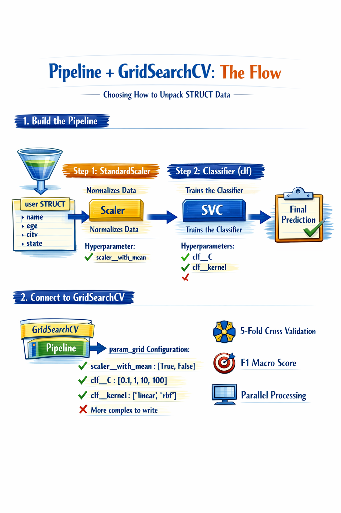
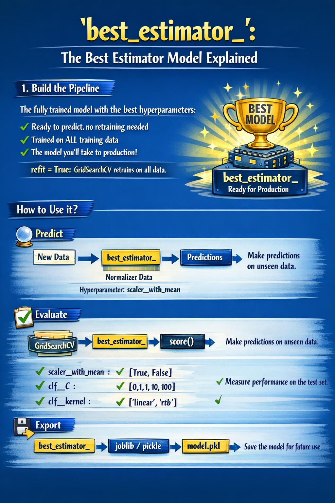

# Hyperparameters, Grid Search, Cross Validation, best estimator

## What are hyperparameters?

### Parameters VS Hyperparameters
**Model parameters:** The model learns these during training (weights, coefficients).

**Hyperparameters:** You define these before training. They control the algorithm's behavior.

- **`n_estimators` (Random Forest):** Number of trees in the forest
- **`max_depth` (Decision Tree / RF)**: Maximum depth of the tree
- **`C` (SVM / Logistic Reg)**: Regularization; controls margin vs. error
- **`kernel` (SVM)**: Type of kernel function (RBF, linear, poly)

---

## Hyperparameters Matter (A Lot)

### Same Data, Different Results
In these examples, only the hyperparameters change.

> Data quality remains fundamental. Hyperparameters can optimize performance, but they cannot compensate for poor data quality.

| Experiment              | n_estimators | max_depth | min_samples_leaf | Accuracy |
| ----------------------- | -----------: | --------: | ---------------: | -------: |
| Baseline Model          |           50 |         5 |                4 |     0.81 |
| Deeper Trees            |           50 |        15 |                4 |     0.84 |
| More Estimators         |          200 |        15 |                4 |     0.87 |
| Reduced Overfitting     |          200 |        10 |                8 |     0.89 |
| Optimized Configuration |          300 |        12 |                5 |     0.92 |

---

## What is GridSearchCV?

It tests **ALL** possible combinations of hyperparameters and evaluates each one with **cross-validation**.

- **Define the grid:** List of values ​​per hyperparameter
- **Train and validate:** Each combination with k folds of cross-validation
- **Choose the best:** Combines the combinations with the highest average score

### Example of a para_grid
- **n_estimators:** 100, 200, 500
- **max_depth:** 5, 10, None

Total combinations: 3x3 = 9

With cv = 5: 9x5 = 45 training sessions

---

## GridSearchCV Workflow (Exhaustive Search)

### 1. Define Grid
Dictionary with the hyperparameters and their possible values
- n_estimators: [100, 200, 500]
- max_depth: [5, 10, None]

### 2. Test Combinations
GridSearchCV generates and tests ALL possible combinations
| Combinations |
| ------------- |
| 100 * 5       |
| 100 * 10      |
| 200 * 5       |
| 200 * 10      |
| 500 * 5       |
| 500 * 10      |

3 x 3 = 9 combinations

### 3. Evaluate with CV
Each combination is evaluated with K-Fold Cross Validation
| Fold 1 | Fold 2 | Fold 3 | Fold 4 | Fold 5 |
| ------ | ------ | ------ | ------ | ------ |
| test   | test   | test   | test   | test   |


### 4. Select Best
The combination with The highest average score is declared the winner.
- best_params_
- best_score_

> Total training = **Number of combinations x Number of folds**. Therefore, GridSearchCV can be computationally intensive; it uses `n_jobs = -1` for parallelization.

---

## Usage Recommendations

### How to Use It?

- When you have a working model but want to optimize it
- When the dataset isn't huge (not days of computation)
- After a preliminary exploratory analysis

### Search Strategy
- Start with broad ranges
- Identify the promising area
- Then refine with narrower ranges

### Don't Use Blindly
- More combinations ≠ better model
- Understand what each hyperparameter does
- Computation time scales quickly

> Pro Tip: RandomizedSearchCV is a faster alternative when the grid is very large. Test first, refine later.

---

## Accessing Hyperparameters with `__`

Within a pipeline, hyperparameters are referenced using double underscores `__` to separate levels.

### Conversion & Example
`step_name__hyperparameter`
```python
clf
```

### Anatomy of the key `clf__n_estimators`
1. Name of the step in the pipeline `clf`
2. Magic separator `__`
3. Hyperparameter of the estimator `n_estimators`

> Works for any step in the pipeline: scaler, transformer, classifier...

---

## Pipeline + GridSearchCV: the flow



---

## Nested Structures: Multiple Levels (`ColumnTransformer`, `KMeans`)

```python
from sklearn.pipeline import Pipeline
from sklearn.compose import ColumnTransformer
from sklearn.cluster import KMeans
from sklearn.preprocessing import StandardScaler
from sklearn.linear_model import LogisticRegression
from sklearn.model_selection import GridSearchCV

# Pipeline with nested ColumnTransformer
preprocessing = ColumnTransformer([
    ('geo', KMeans(n_clusters=5), geo_cols),
    ('num', StandardScaler(), num_cols)
])

pipeline = Pipeline([
    ('preprocessing', preprocessing),
    ('clf', LogisticRegression())
])

# Multi-level access with __
param_grid = {
    'preprocessing__geo__n_clusters': [3, 5, 8, 10],
    'clf__c': [0.01, 0.1, 1, 10]
}

grid_search = GridSearchCV(pipeline, param_grid, cv=5)
grid_search.fit(X_train, y_train)
```

### Pipeline Hierarchy
```
Pipeline/
├── preprocessing (ColumnTransformer)/
│   ├── geo (KMeans) → n_clusters
│   └── num (StandardScaler)
└── clf (LogisticRegression) → C
preprocessing__geo__n_clusters
clf__C
```
> Each additional `__` moves down one level in the hierarchy. No depth limit

---
## When the Search Falls Short

### Warning Sign
If the best value is on the edge of the grid, the true optimum is probably outside the explored range.

Example:
```python
n_estimators: [10, 50, 100]
best: 100 → edge!

There are larger values ​​yet to be explored: 200, 500, 1000...
```

### Iterative Strategy
1. **Broad Search:** Large ranges to cover the space [10, 100, 500, 1000]
2. **Detect Promising Zone:** Where are the best scores? On the edge?

best = 500 (Not on the edge)
3. **Refine the Range:** Dense grid around the promising zone
[300, 400, 500, 600, 700]
> Repeat until the best value is in the center of the grid

---

## `best_estimator_`: The winning model (Production-ready model)
