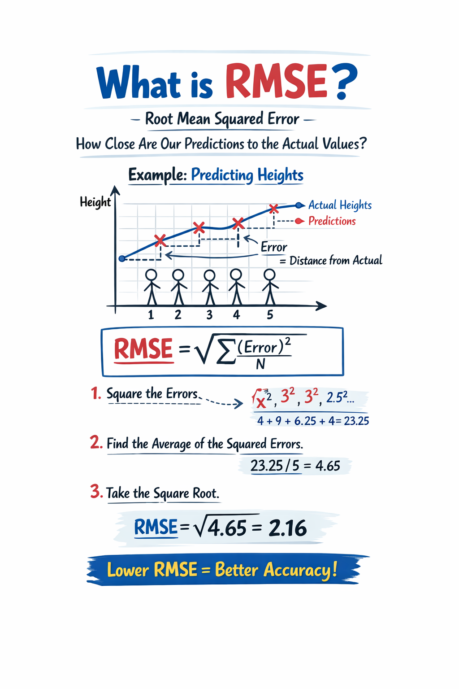
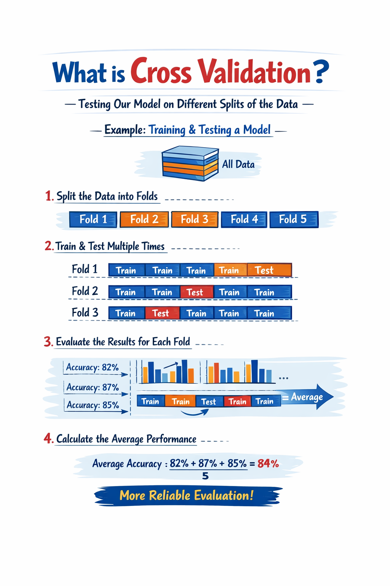
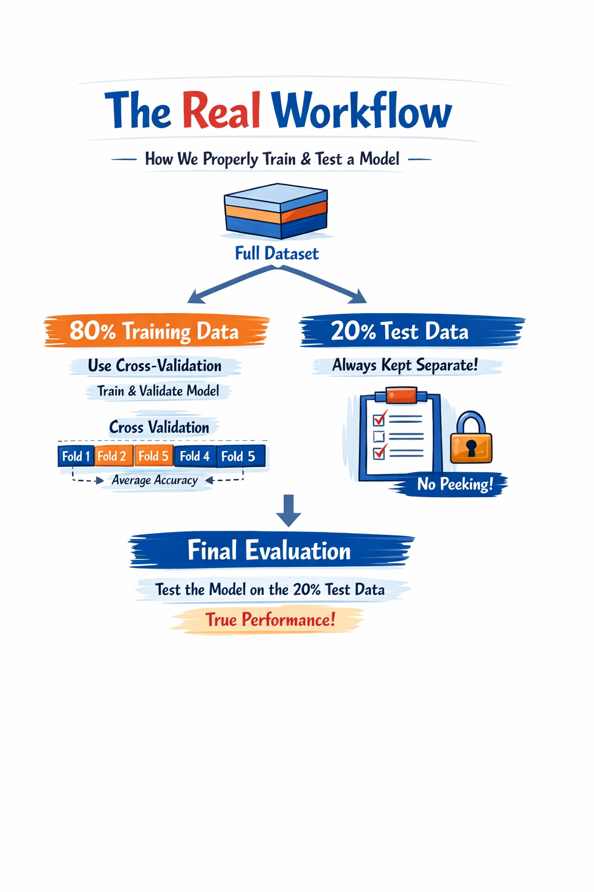
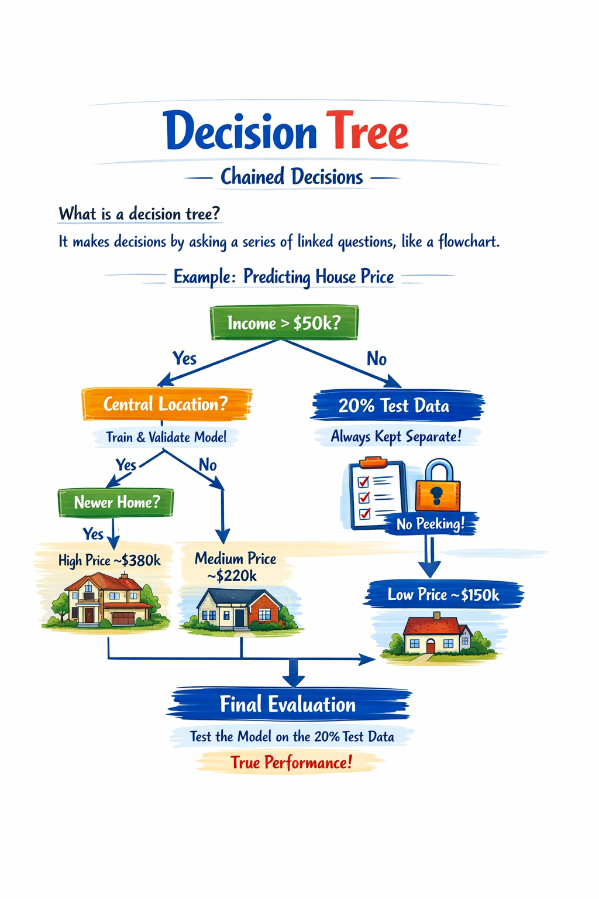
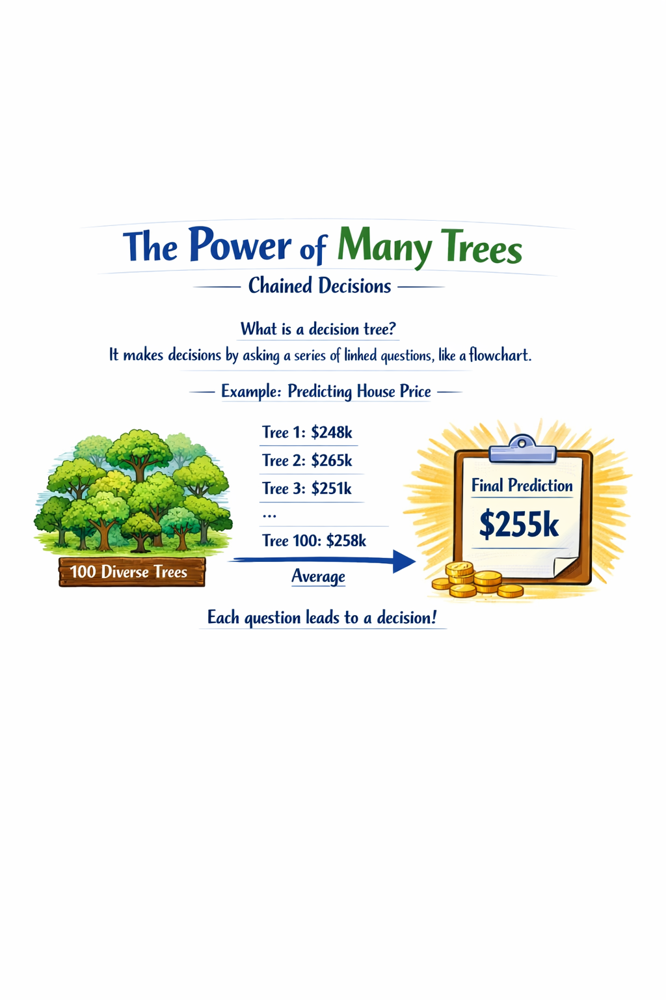

# Model training in Scikit-Learn

## RMSE, Cross Validation, Decision Trees, Random Forest

## 1. RMSE

### Intuitive Idea

What does **RMSE** measure?

How far the model's predictions are from the actual values.

- It penalizes large errors more (by squaring them)
- Result in the same units as the data
- Lower value = better model
- RMSE = 0 means perfect prediction

### Formula and Calculation

$$
\mathrm{RMSE}(X, y, h) \;=\; \sqrt{\frac{1}{m} \sum_{i=1}^{m} \left( h\left(x^{(i)}\right) - y^{(i)} \right)^2}
$$

- m: total number of data points
- h(x): model prediction
- y: actual value

### Example Temperature Prediction

| Day 	| Real (y) 	| Prediction h(x) 	| Error 	|
|:---:	|:--------:	|:---------------:	|:-----:	|
|  1  	|    20    	|        18       	|   -2  	|
|  2  	|    25    	|        30       	|   5   	|
|  3  	|    30    	|        28       	|   -2  	|

**Step by step:**
1. Errors: -2, 5, -2
2. Squared errors: 4, 25, 4
3. Average: $\frac{(4 + 25 + 4)}{3}  = 11$
4. Square root: $\sqrt{11} = 3.3$

RMSE = 3.3
On average, the model is off by ~3 degrees

### Interpretation and Use

How to interpret RMSE?

- ✅ `0` Perfect prediction
- 👍 `Low` Accurate model
- ⚠️ `High` Inaccurate model

> Always use the same units as the data (km, °C, $, ... )

- Regression problems: Predicting continuous numerical values
- Penalizing large errors: When serious failures are costly
- Avoiding major failures: Critical systems such as pricing or diagnostics

---

## 2. Cross Validation

### Reliable Evaluation

**The problem:** A single train/test split can yield unrepresentative results.

**The solution:** Evaluate the model multiple times with different splits and average the scores.

> Each data point acts as a test at least once.

### Actual Flow

- **Untouchable Test Set:** Never used during training or cross-validation. Only touched once at the end for the final model evaluation.

- **Cross-validation at 80%:** Divided into k folds to adjust hypermeters and reliably compare models.

### How Many Folds?

- **k = 10** `Standard`: Balance between accuracy and computational cost
- **k = 5** `Large Datasets`: Faster when there is a lot of data available
- **k = n** `Leave-One-Out`: For very small datasets, maximum accuracy, very slow.

---

## Decision Tree
### Chained Decisions

What is a decision tree? It makes decisions by asking a series of linked questions, like a flowchart.
> Example: Predicting the price of a house based on income, location, and age.

### Key Terms and Types

- **Root Node:** The first question in the tree (the most important)
- **Internal Nodes:** Intermediate questions that branch out from the tree
- **Leaf Nodes:** Final nodes that return the predicted value

_`DecisionTreeRegressor`_ Continuous numeric values.
> House price: $284,000

_`DecisionTreeClassifier`_ Categories or classes
> Type: Luxury / Standard / Economy

## The Overfitting Problem

- Memorizes instead of learning: The tree learns each training data point by rote, including noise.

RMSE in Training: 0 
`Perfect prediction!`

RMSE in Cross-Value: 66,574 
`Poor with new data`

> An RMSE of 0 in training is a warning sign, not a sign of success.

## The Power of Many Trees

> Individual errors cancel out when averaging.

- Bagging: Each tree is trained with a random sample from the dataset.

- Feature Randomness: Each split uses a random subset of variables.

