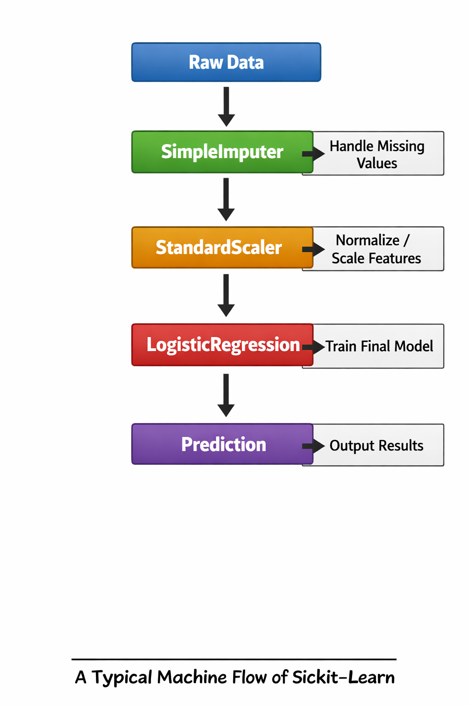

# Pipeline in Scikit-Learn explained from scratch

Automation, Preprocessing, Production

## Fundamental Concepts

### Estimator
An object that learns from the data. The foundation of the entire Scikit-Learn API.
`fit(X, y)`
> Adjusts internal parameters

### Transformer
Specialized in cleaning, reducing, and generating feature representations.
`fit(X, y)`
`transform(X)`
`fit_transform()`

### Predictor
An estimator that generates predictions based on new data.

`fit(X, y)`
`predict(X)`
> Logistic Regression, Linear Regression

---

## Key API Methods
Each object type implements a subset of methods according to its role.

| Concept        | Method            | Signature              | Type        | Simple Explanation                                                                 |
|----------------|------------------|------------------------|-------------|-------------------------------------------------------------------------------------|
| Training       | fit()            | fit(X, y)              | Estimator   | Learns patterns from data. X = features, y = labels (answers).                     |
| Transformation | transform()      | transform(X)           | Transformer | Changes data (e.g., scaling or encoding) without learning anything new.            |
| Train + Transform | fit_transform() | fit_transform(X, y)   | Transformer | Learns from the data and immediately applies the transformation in one step.       |
| Prediction     | predict()        | predict(X)             | Predictor   | Uses what was learned during training to make predictions on new data.             |

---

## What is a Pipeline?
It chains multiple preprocessing steps and a final estimator into a single workflow.

`sklearn.pipeline.Pipeline`
> acts as a composite estimator, a single object with fit, predict, and transform.

### Typical Pipeline Flow


---

## Without Pipeline VS With Pipeline

### 😅 Without Pipeline
Prone to errors, DIFFICULT to maintain
```python
# Step 1: Imputer
imputer = SimpleImputer(strategy='mean')
X_train_imp = imputer.fit_transform(X_train)
X_test_imp = imputer.transform(X_test) # ⚠️ manual

# Step 2: Scaler
scaler = StandardScaler()
X_train_sc = scaler.fit_transform(X_train_imp)
X_test_sc = scaler.transform(X_test_imp) # ⚠️ manual
```

### ✅ With Pipeline
Automatic, Safe, Clean
```python
from sklearn.pipeline import make_pipeline

# A single object encapsulates everything
pipe = make_pipeline(
    SimpleImputer(strategy='mean'),
    StandardScaler(),
    LogisticRegression()
)

pipe.fit(X_train, y_train)
y_pred = pipe.predict(X_test) # ✅ Simple
```

---

## Advantages of Using Pipelines

### Convenience
A single `fit()` and `predict()` for the entire flow.
No repeated manual calls.

### Hyperparameters
GridSearchCV optimizes parameters for all steps simultaneously.

### Data Leakage (CRITICAL)
`fit()` is only applied to training data within each cross-validation fold.

### Reproducibility
A single serialized object captures the entire state. Ideal for auditing and collaboration.

### Optimization
The `memory` parameter stores transformers. Accelerates repeated experiments.

---

## General Pipeline Structure

### Anatomy of a Step `('name', estimator)`

- **'name':** Unique string identifier of the step
- **estimator:** Transformer or predictor

### Fundamental Rules
1. All intermediate steps must be Transformers
2. The last step can be any estimator.
3. Steps are executed in strict sequential order.

```python
from sklearn.pipeline import Pipeline
from sklearn.impute import SimpleImputer
from sklearn.preprocessing import StandardScaler
from sklearn.linear_model import LogisticRegression

# List of tuples (name, estimator)
pipe = Pipeline([
    ('imputer', SimpleImputer()),
    ('scaler', StandardScaler()),
    ('classifier', LogisticRegression())
])

# Access a step
pipe['scaler']
pipe.named_steps['imputer']
```

---

## Remember what a Pipeline is

It chains transformers and a final estimator into a single object.

Each step receives the output of the previous one, and Scikit-learn handles calling `fit_transform` in the intermediate steps and `fit` in the last one.

```
X → step_1 → step_2 → ... → model → ŷ
```

### **Rule**
All intermediate steps must implement `fit_transform`. The last step can be a transformer or a predictor.

---

## Execution Flow: `predict()`

`pipeline.predict(X_test)`

### 1. Step 1: Transformer `transform(x)`
Uses parameters learned in `fit()`

### 2. Step 2: Transformer `transform(x_transformed)`
Applies chained transformations

### Last Step: Predictor `predict(X_final)`
Generates final predictions

> ⚠️ `fit()` is NEVER called during `predict()`

### Data Leakage Prevention
Parameters are learned ONLY from the training set.

New data is transformed using these parameters, without "seeing" the training set.

### `fit()` VS `predict()`
|   _`fit()`_   	| `fit_transform()` 	| `fit()`     	|
|:-----------:	|-------------------	|-------------	|
| _`predict()`_ 	| `transform()`     	| `predict()` 	|

---

## make_pipeline, Simplified Alternative

### Manual Pipeline
```python
from sklearn.pipeline import Pipeline

pipe = Pipeline([
    ("scaler", StandardScaler()),
    ("classifier", LogisticRegression())
])
```

**Assigned Names:**
- 'scaler' → StandardScaler
- 'classifier' → LogisticRegression

### make_pipeline (recommended)
```python
from sklearn.pipeline import make_pipeline

pipe = make_pipeline(
    StandardScaler(),
    LogisticRegression()
)
```

**Auto-generated Names:**
- 'standardscaler' → StandardScaler
- 'logisticregression' → LogisticRegression

> If there are duplicate classes, add suffixes: 'standardscaler', 'standardscaler-2'

---

## ColumnTransformer, The Problem

### Heterogeneous Data
Columns of different data types require different transformations

| **age (num)** 	| **salary(num)** 	| **city(cat)** 	|
|:-------------:	|-----------------	|---------------	|
|       25      	|      50.000     	|   _New York_  	|
|       30      	|      60.000     	|    _London_   	|
|      NaN      	|      75.000     	|    _Paris_    	|
|       45      	|       NaN       	|    _London_   	|
|       22      	|      45.000     	|   _New York_  	|

### The Solution: `ColumnTransformer`
1. `age, salary`: Impute (mean) → StandardScaler
2. `city`: Impute (mode) → OneHotEncoder

```python
from sklearn.compose import ColumnTransformer

ct = ColumnTransformer([
    ("num", num_pipeline, ["age", "salary"]),
    ("cat", cat_pipeline, ["city"])
])

# remainder = 'drop'
```

## Convenience Helpers

### `make_column_transformer`
Creates a `ColumnTransformer` without names

```python
from sklearn.compose import make_column_transformer

ct = make_column_transformer(
    (StandardScaler(), ['age', 'salary']),
    (OneHotEncoder(), ['city'])
)

# No need for names
```


### `make_column_selector`
Selects columns by `dtype` or name
```python
from sklearn.compose import make_column_selector
import numpy as np

# Automatically numeric
num_selector = make_column_selector(
    dtype_include = np.number
)

# or by regular expression pattern
pattern = make_column_selector(
    pattern='^feat_'
)
```