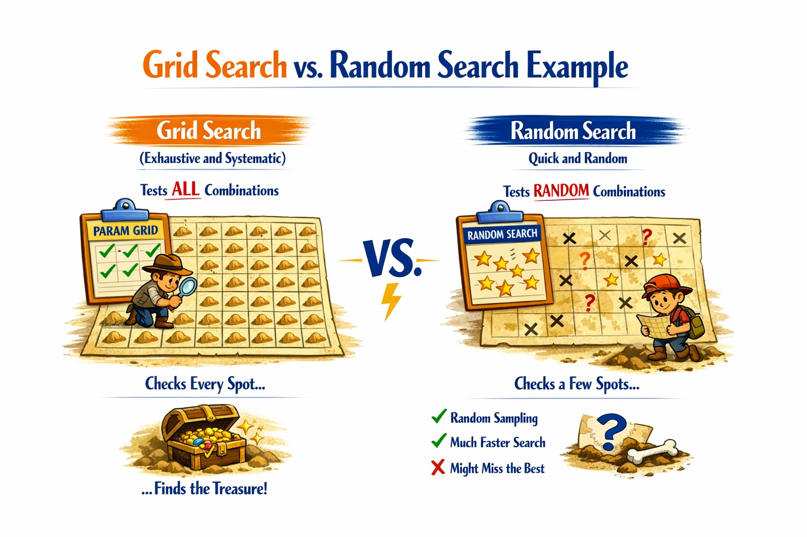
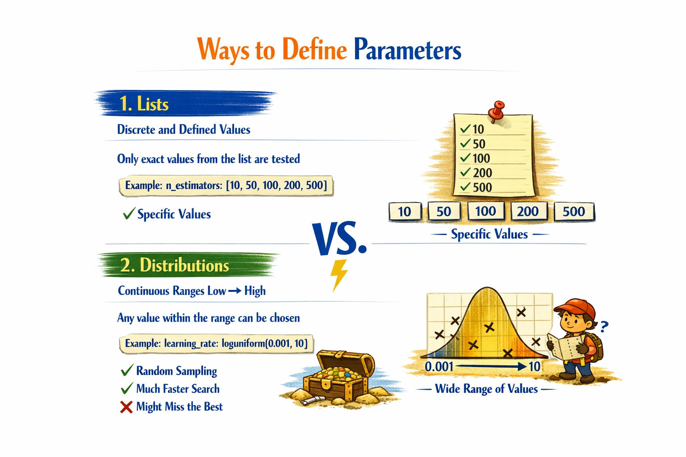
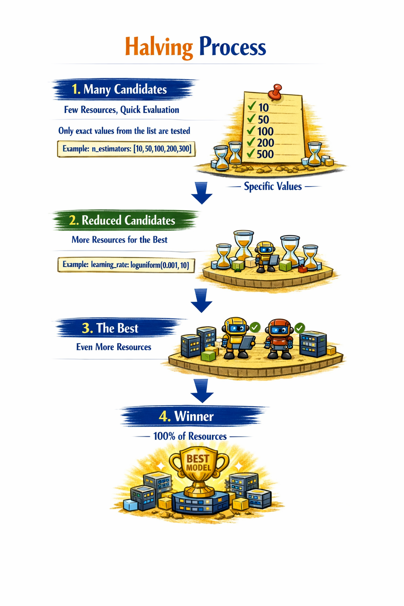
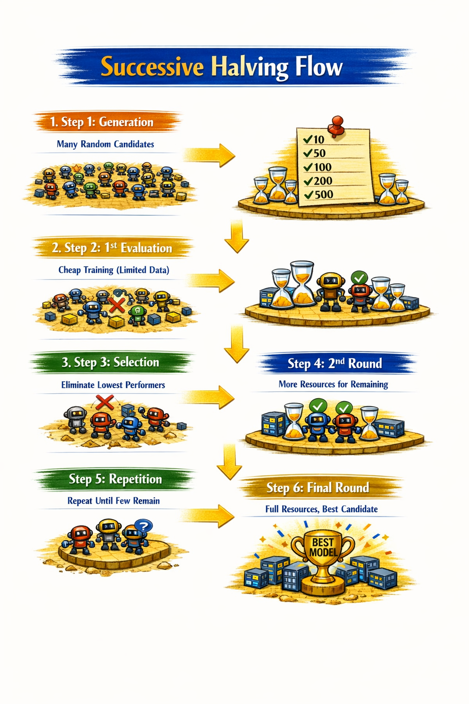
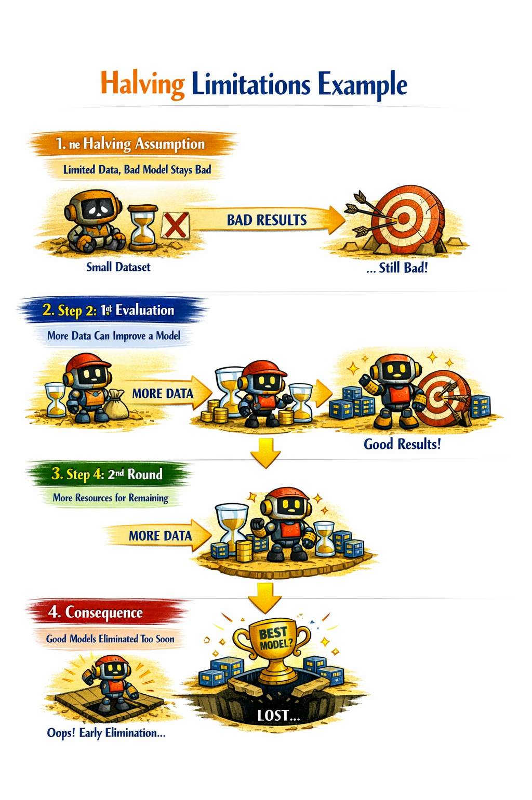
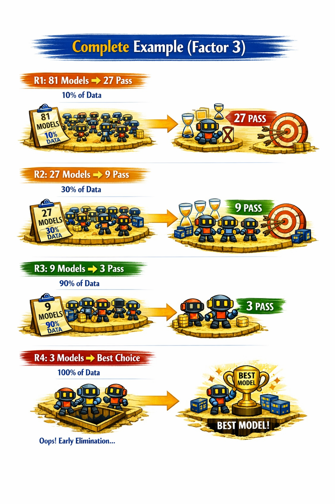

# Efficient hyperparameter search, Successive Halving, Evaluation strategies

---
## What is RandomizedSearchCV?

### Grid Search (Exhaustive, Slow)
Tests **ALL** combinations

### Random Search (Efficient, Fast)
Tests **RANDOM** combinations

---

## The Problem with Grid Search

### Hyperparameters
3 x 10 values ​​each

### Combinations
1000 training runs required

### Computation Time
10 times more vs. Random Search

> With more hyperparameters, the cost grows **exponentially**

---

## Ways to Define Parameters

### 1. Lists
Discrete and defined values

Only exact values ​​from the list are tested
> Example: `n_estimators: [10, 50, 100, 200, 500]`

### 2. Distributions
Continuous ranges low → high
Any value within the range can be chosen

> Example: `learning_rate: loguniform(0.001, 10)`

---

## Advantages of RandomizedSearchCV

### 1. **More efficient:** Fewer training sessions for similar results
### 2. **Larger ranges:** Better explores high dimensions of hyperparameters
### 3. **Discovery:** Finds previously unseen values
### 4. **Total control:** You define exactly how much time to invest
### 5. **Better results:** Outperforms GridSearch in practice

---
## What is Successive Halving?

### Test many combinations
Start with a large set of random candidates
### Don't fully train them
Initially, each model receives few resources (data, iterations)
### Key concept
**"Start cheap, and only invest in what promises"**

### Halving Process

---

### Successive Halving Flow

---

## Halving Limitations

### The Halving Assumption
A bad model with limited resources... **will still be bad**

### The Reality
This **is NOT always true**. Some models need more data to truly shine.

### Consequence
It can **"kill"** good models too early

---

## The Halving Factor

### What does the factor control?

A single parameter that defines how much is eliminated and how much resources grow in each round

### Models that survive (1 / factor)
factor = 3 → 1 out of every 3 survives

### Resources per round (Per Factor)
factor = 3 → resources triple

---

## Complete Example, Factor = 3
